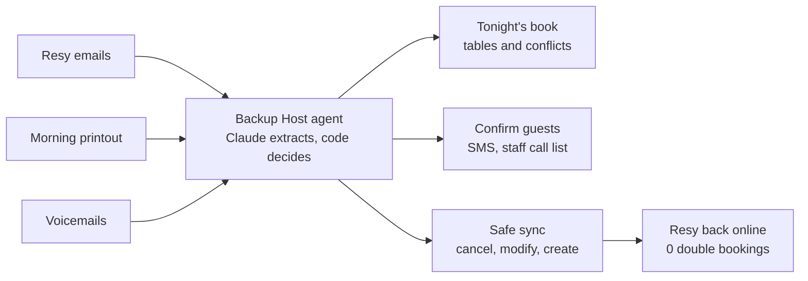
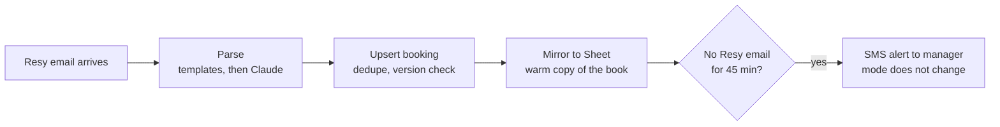
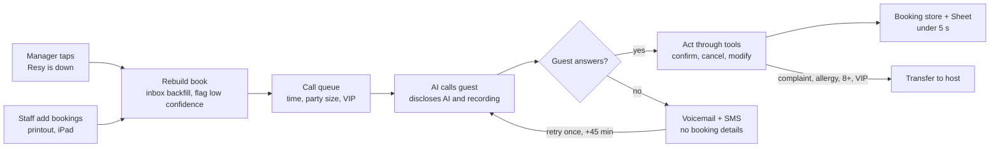
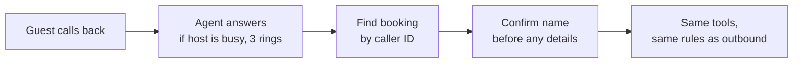
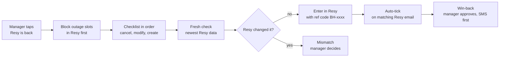

# Backup Host: workflow

Resy goes down at 2 PM and service starts at 5:30. Backup Host has 3 modes and 1 inbound flow. The manager changes the mode; the system can alert, but it never changes the mode by itself. Every write goes through the tools API, and a human decides every conflict.

## Overview

## Normal mode (always on)

## Outage mode (Resy is down)

Guardrails: pending bookings hold their tables, and a human edit always wins over an agent write.

## Inbound calls (Flow D)

## Recovery mode (Resy is back)

## The race that the safe sync stops

| Time | Event |
| --- | --- |
| 6:58 PM | Resy comes back online. |
| 6:58 PM | A web guest books the last 4-top at 7:00 PM. |
| 6:59 PM | Sync tries to add Leila Ahmadi (4 at 7:00 PM), booked by phone during the outage. |
| 6:59 PM | Conflict, not a double booking. The host offers Leila 8:30 PM. |

Code: `sync.py` (op log, cancels first, check-then-write, idempotency keys, verify). Full spec: `PRD_Resy_Outage_Agent_v2.md`.
