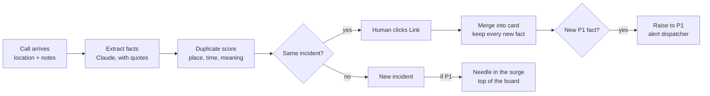

# Sift: AI triage for 911 call surges

**Challenge 3: 911 call management.** After an incident, call volumes spike. Develop a way to identify duplicate reports and flag high-priority cases for immediate response.

25 calls about one fire should not bury a cardiac arrest. Sift merges duplicates, surfaces new P1 facts, and puts the hidden emergency first. A human approves every link.

## Run the demo

Open `dashboard.html` in any browser. It works offline. Move the slider to 0 and press **Play**: a 6-minute surge of 25 sample calls replays in about 18 seconds.

## The idea

1. **Merge duplicates.** Calls about the same incident go into one card. 18 fire calls become 1 row with "18 callers".
2. **Keep new facts.** Duplicates are not noise. When caller 9 says "a kid is on the 4th floor", Sift marks a new fact and raises the incident to P1.
3. **Find the needle.** A call that is not part of the surge (a cardiac arrest 2 blocks away, a silent crash-detection call) goes to the top as a separate P1.

Sift suggests; a human decides. Sift can raise a priority, but only a human can lower it.

## How a match works

```
score = 0.45 x distance + 0.20 x time + 0.35 x meaning
```

- 0.75 or more: suggest **Link** (one click).
- Different emergency types (for example, fire and medical) never merge.
- Every priority shows the rule that set it.



## Channels in the demo

Wireless (14), text-to-911 (3), VoIP (2), landline, TTY, ASL relay, alarm company, phone crash detection, and car telematics (1 each). All sample data is invented.
